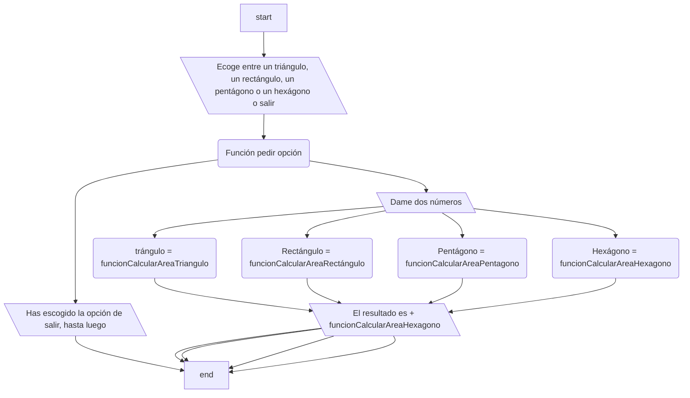

```mermaid
flowchart TD;
    Inicio[start]
    Inicio --> escoger[\Ecoge entre un triángulo, un rectángulo, un pentágono o un hexágono o salir\]
    escoger --> pedirOpcion(Función pedir opción)
    pedirOpcion --> salir[\Has escogido la opción de salir, hasta luego\] --> Fin[end]
    pedirOpcion --> funcionPedirNumero[\Dame dos números\]
    funcionPedirNumero --> triangulo(trángulo = funcionCalcularAreaTriangulo) --> resultado[\El resultado es + funcionCalcularAreaHexagono\] -->Fin[end]
    funcionPedirNumero --> rectangulo(Rectángulo = funcionCalcularAreaRectángulo) --> resultado[\El resultado es + funcionCalcularAreaHexagono\] --> Fin[end]
    funcionPedirNumero --> pentagono(Pentágono = funcionCalcularAreaPentagono) --> resultado --> Fin[end]
    funcionPedirNumero --> hexagono(Hexágono = funcionCalcularAreaHexagono) --> resultado[\El resultado es + funcionCalcularAreaHexagono\] --> Fin[end]
```
